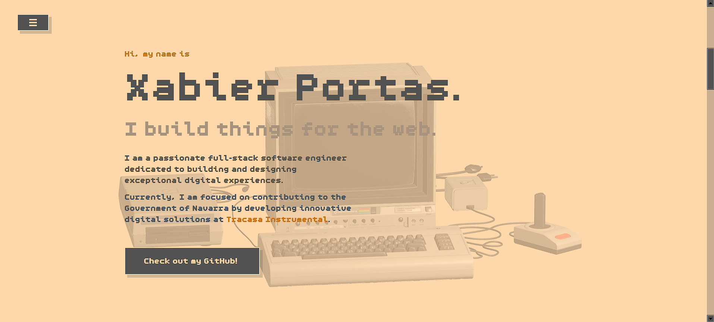

<div align="center">
  
</div>
<h1 align="center">
  xportas retro website
</h1>
<p align="center">
  An open-source project containing the source code of my personal website.
</p>
<p align="center">
  This project was created using the following technologies:
  <ul>
    <li><strong>Next.js</strong> and <strong>React</strong>: Used for building the website.</li>
    <li><strong>Three.js</strong>: Utilized for rendering the 3D model on the website.</li>
    <li><strong>Tailwind CSS</strong>: Employed for styling the website.</li>
    <li><strong>Other</strong>: the basics, CSS, HTML and JavaScript, to take design, customization and user experience to another level.
  </ul>
</p>



## 🚨 Before forking this repo

Since I embarked on the development of this project, it was clear to me that it was going to be open source because I owe it to the community. Whenever I needed it, I found in it the collaboration and generosity that has helped me grow as a developer. This project has taken me countless hours of work and I have learned a lot in the process. Now, I want to return the favor and do my part to keep the community alive.

That said, while I love it when people use, learn from or even get inspired by my work, plagiarism is not okay. If you want to reuse any part of this project, I only ask that you give me proper credit by linking back to [xabierportas.dev](https://xabierportas.dev). This project is the result of a lot of effort and dedication, and I simply want that work to be recognized.

Thanks for understanding and I hope you enjoy finding all the easter eggs that I have left along this path😊

## 🛠 Installation & Set Up

1. Install the required npm packages and dependencies and then, run the project

```bash
npm install

```

```bash
npm run dev

```
2. Open [http://localhost:3000](http://localhost:3000) and let your journey into the past begin! 🚀🚀

## 🌈🥚 Easter Eggs

Did you really think there wouldn't be? Men, I'm a developer...

But of course I'm not going to make it easy for you to find them. The only clue I can give you is... it is also possible that you need to change some lines of code to find others and go back (even more) to the past.

Here you have the list of all of them, from easiest to hardest. Will you be able to find them all?
<ul>
  <li>
    There is nothing more retro and vintage than the <strong>PacMan</strong> game, do you dare to play a game?
  </li>
  <li>
    No my friend, <strong>smartphones</strong> didn't exist in those years...
  </li>
  <li>
    If you are one of those who hate the noise made by the old machines... why don't you try activating the sound of the Commodore? When we were little and we were hiding to play at night without being discovered, we always put the sound on <strong>M</strong>ute...
  </li>
  <li>
    What a pity! The <strong>plumber</strong> just left and left everything working, but if you go back in time you will find it for sure!
  </li>
</ul>